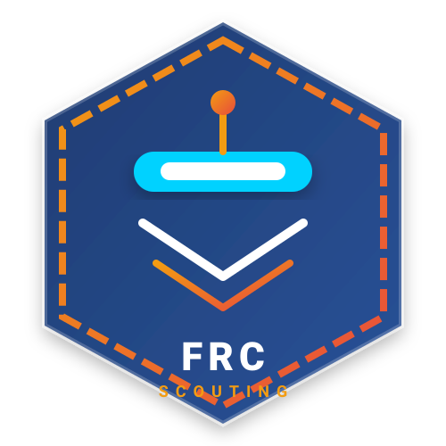

# 🤖 FRC SCOUT APP — Yeni Nesil FRC Scout & Strateji Analiz Platformu
### *Next-Generation FRC Match & Pit Scouting, Strategy & Alliance Selection Platform*

<div align="center">



<br/>

[](https://frcscoutingapp.me)
[](https://php.net)
[](https://mysql.com)
[](https://www.thebluealliance.com)
[](https://statbotics.io)
[](LICENSE)

**[🇹🇷 Türkçe Dokümantasyon](#-türkçe-dokümantasyon)** &nbsp;|&nbsp; **[🇬🇧 English Documentation](#-english-documentation)**

</div>

---

> 🚀 **CANLI DEMO / LIVE DEMO:**  
> Projeyi bilgisayarınıza kurmadan doğrudan denemek için canlı web sitemizi ziyaret edebilirsiniz:  
> 🔗 **[https://frcscoutingapp.me](https://frcscoutingapp.me)**  
> *(Test account registration is open to all FRC teams worldwide)*

---

## 🇹🇷 Türkçe Dokümantasyon

**FRC SCOUT APP**, FIRST Robotics Competition (FRC) takımlarının turnuvalarda rakiplerini ve müttefiklerini detaylı şekilde gözlemlemesini (scout), canlı The Blue Alliance (TBA) ve Statbotics verileriyle zenginleştirilmiş analizler yapmasını ve eleme turlarında en doğru ittifak seçimini gerçekleştirmesini sağlayan modern, çoklu takım (multi-tenant) destekli bir strateji platformudur.

🌐 **Canlı Demo:** [https://frcscoutingapp.me](https://frcscoutingapp.me)

---

### ✨ Öne Çıkan Özellikler

* **🏢 Çoklu Takım (Multi-Tenant) Mimarisi:**
  * Her FRC takımı sisteme kendi takım numarasıyla bağımsız olarak kayıt olur.
  * Takımların scout notları, pit verileri, robot ağırlıkları ve özel strateji ağırlıkları tamamen kendi veritabanı alanlarında izole edilir; diğer takımlar bu gizli verilere erişemez.
* **🌐 The Blue Alliance (TBA) v3 & Statbotics EPA Entegrasyonu:**
  * Her takım kendi ücretsiz TBA API anahtarını tanımlar.
  * Aktif sezon turnuvaları, katılan takımlar, canlı maç fikstürleri ve sıralamalar resmi TBA sunucularından anlık çekilir.
  * Statbotics EPA tahminleriyle robotların güç skorları karşılaştırılır.
* **📊 Maç Gözlemi (Match Scouting):**
  * Otonom dönem: Yakıt skorları, tırmanma, otonom rota çizimi.
  * Teleop dönem: Skorlama hacmi, tırmanma seviyesi, besleme/damper kalitesi, döngü hızı.
  * Robot rolü (Skorer, Besleyici, Defans) ve defans/sürücü kaçış kabiliyetleri.
* **🛠️ Pit Gözlemi (Pit Scouting) & Robot Galerisi:**
  * Robot ağırlığı, şasi (drivetrain) tipi, atıcı, almaç ve tırmanma mekanizmaları.
  * Robot fotoğrafları ve teknik pit notları.
* **🏆 Turnuva Analiz Masası & İttifak Simülatörü:**
  * İttifak seçimlerinde birinci ve ikinci seçim robotlarını belirlemek için canlı sıralama ve filtreleme.
  * Gerçek scout verisi ile Statbotics EPA modelini harmanlayan özel **1st Pick / 2nd Pick** algoritması.
* **⚖️ Özelleştirilebilir Ağırlık Algoritmaları:**
  * Takım stratejinize göre otonom, teleop, tırmanma ve defansın toplam skora etkisini ayarlayabileceğiniz dinamik katsayı masası.
* **👤 Profil Yönetimi & Onaylı Takım Transferi:**
  * Kullanıcılar ad, e-posta ve şifrelerini profil masasından güncelleyebilir.
  * Takım değiştiren üyeler yeni takımına **Transfer Talebi** gönderir; hedef takımın yöneticisi panelden onayladığında güvenli geçiş sağlanır.
* **🔐 Token Destekli Güvenli Şifre Sıfırlama:**
  * Süreli, kriptografik token destekli şifre sıfırlama akışı.
  * Canlı sunucular için SMTP (Gmail, Kurumsal vb.) desteği.

---

### 💻 Sistem Gereksinimleri

* **Web Sunucusu:** Apache (önerilen) veya Nginx (URL Rewrite modülü aktif olmalı)
* **PHP Sürümü:** PHP 8.0, 8.1, 8.2 veya üzeri
* **PHP Eklentileri:** `pdo_mysql`, `mysqli`, `curl`, `json`, `mbstring`, `openssl`
* **Veritabanı:** MySQL 5.7+ veya MariaDB 10.4+
* **The Blue Alliance API Anahtarı:** Ücretsiz [thebluealliance.com/account](https://www.thebluealliance.com/account) adresinden alınabilir.

---

### 🚀 1. Localhost Kurulumu (XAMPP / WampServer / Docker)

#### 1.1. Dosyaları İndirin
Projeyi bilgisayarınızın web kök dizinine (örneğin XAMPP için `C:\xampp\htdocs\score`) klonlayın veya zip olarak çıkarın:
```bash
git clone https://github.com/captnfirst/FRC-Scout-App-2026.git C:/xampp/htdocs/score
```

#### 1.2. Veritabanını Oluşturun ve İçe Aktarın
1. XAMPP Control Panel'den **Apache** ve **MySQL** servislerini başlatın.
2. Tarayıcınızda `http://localhost/phpmyadmin` adresine gidin.
3. `score` adında yeni bir veritabanı oluşturun (`utf8mb4_unicode_ci` seçin).
4. Üst menüden **İçe Aktar (Import)** sekmesine tıklayın ve proje dizinindeki [`database.sql`](database.sql) dosyasını seçip çalıştırın.

#### 1.3. Uygulamayı Başlatın
Tarayıcınızı açın ve adrese gidin:
```
http://localhost/score/web/default/login
```
*(veya VirtualHost / Domain yönlendirmeniz varsa `http://localhost/default/login`)*

1. **"Create New Team Account"** bağlantısına tıklayın.
2. Takım numaranızı (örn: `6459` veya `9483`), adınızı ve şifrenizi girerek kaydolun.
3. Sol menüden **"Team & API Settings"** sayfasına giderek [The Blue Alliance](https://www.thebluealliance.com/account)'dan aldığınız ücretsiz API anahtarını girin ve kaydedin.

---

### 🌐 2. Canlı Sunucu / Hosting Kurulumu (cPanel, Plesk, VPS)

Projeyi kendi alan adınızda (Domain/Hosting) çalıştırmak için aşağıdaki adımları izleyin:

#### 2.1. Dosyaları Sunucuya Yükleyin
* Proje dosyalarını hosting panelinizin Dosya Yöneticisi (File Manager) veya FTP (FileZilla) ile sunucunuza yükleyin (örnek: `/public_html` veya bir alt alan adı klasörüne).

#### 2.2. Web Kök Dizinini (DocumentRoot) Ayarlayın
* Güvenlik ve temiz MVC mimarisi için alan adınızın web kök dizinini projenin **`/web`** klasörüne yönlendirmeniz önerilir:
  * **cPanel / Plesk:** Subdomain veya Domain DocumentRoot alanını `public_html/score/web` yapın.
  * **Paylaşımlı Hosting (DocumentRoot değiştirilemiyorsa):** Proje kök dizininde yer alan `.htaccess` dosyası gelen tüm trafiği otomatik ve güvenli olarak `/web` dizinine yönlendirir.

#### 2.3. MySQL Veritabanı ve Kullanıcı Oluşturun
1. Hosting panelinizden yeni bir MySQL veritabanı ve bir kullanıcı oluşturup şifre belirleyin.
2. Kullanıcıya tüm yetkileri (ALL PRIVILEGES) verin.
3. **phpMyAdmin**'e girerek projedeki [`database.sql`](database.sql) dosyasını içe aktarın.

#### 2.4. The Blue Alliance (TBA) API Anahtarını Alma
1. [thebluealliance.com](https://www.thebluealliance.com) sitesine gidin ve oturum açın (veya ücretsiz üye olun).
2. Sağ üstten kullanıcı adınıza tıklayıp **Account** sayfasına gidin.
3. Sayfanın altındaki **"Read API Keys"** bölümünden bir açıklama girip **"Generate Key"** butonuna basın.
4. Oluşan uzun anahtarı kopyalayın ve FRC SCOUT APP panelinizde **"Team & API Settings"** alanına yapıştırıp kaydedin.

---

## 🇬🇧 English Documentation

**FRC SCOUT APP** is a next-generation, multi-tenant scouting, match observation, and strategy platform designed for FIRST Robotics Competition (FRC) teams worldwide. It combines real human scouting data with live The Blue Alliance (TBA) v3 API and Statbotics EPA metrics to power data-driven alliance selections and match tactical planning.

🌐 **Live Demo Website:** [https://frcscoutingapp.me](https://frcscoutingapp.me)

---

### ✨ Key Features

* **🏢 Multi-Tenant Team Isolation:**
  * Supports thousands of independent teams. Each team registers with their FRC team number.
  * Scout logs, pit observations, robot photos, notes, and strategy weight configurations are strictly isolated per tenant.
* **🌐 The Blue Alliance (TBA) API v3 & Statbotics EPA Integration:**
  * Dynamic event schedules, team rosters, real-time match rankings, and match breakdowns.
  * Statbotics Expected Points Added (EPA) integration to benchmark robot capabilities.
* **📊 Comprehensive Match Scouting:**
  * Autonomous: Fuel scoring count, climb, autonomous path plotting.
  * Teleop: Fuel count, climb rung level, feeding/damper efficiency, cycle speed ratings.
  * Robot roles (Scorer, Feeder, Defense), defensive strength, and driver evasion ratings.
* **🛠️ Pit Scouting & Robot Technical Gallery:**
  * Drive train types, robot weight, intake/shooter mechanisms, climb capabilities, and high-resolution photo uploads.
* **🏆 Tournament Analytics & Alliance Selection Board:**
  * Custom 1st Pick & 2nd Pick algorithm balancing pit data, scout ratings, and Statbotics EPA.
  * Instant 1st pick and 2nd pick sorting filters for playoff alliance draft sessions.
* **⚖️ Customizable Score Weight Engine:**
  * Customize the relative importance of auto, teleop, climb, and defensive attributes according to your team's match philosophy.
* **👤 User Profile & Approval-Based Team Transfer:**
  * Profile management (Name, Email, Password).
  * Team transfer requests: Users can submit a transfer request to join another team. The target team admin can approve or reject with live dashboard badges.
* **🔐 Token-Based Password Reset & SMTP Support:**
  * Secure, time-limited cryptographic token reset links with production SMTP mail delivery.

---

### 💻 System Requirements

* **Web Server:** Apache (recommended with `mod_rewrite`) or Nginx
* **PHP:** PHP 8.0, 8.1, 8.2 or higher
* **PHP Extensions:** `pdo_mysql`, `mysqli`, `curl`, `json`, `mbstring`, `openssl`
* **Database:** MySQL 5.7+ or MariaDB 10.4+
* **The Blue Alliance API Key:** Free via [thebluealliance.com/account](https://www.thebluealliance.com/account)

---

### 🚀 1. Localhost Setup Guide (XAMPP / Docker / WAMP)

#### 1.1. Clone or Extract
```bash
git clone https://github.com/captnfirst/FRC-Scout-App-2026.git C:/xampp/htdocs/score
```

#### 1.2. Database Setup
1. Start **Apache** and **MySQL** in XAMPP.
2. Open `http://localhost/phpmyadmin`.
3. Create a database named `score` with collation `utf8mb4_unicode_ci`.
4. Click **Import** and select the [`database.sql`](database.sql) file.

#### 1.3. Run the Application
Navigate to:
```
http://localhost/score/web/default/login
```
* Register your team, go to **Team & API Settings**, paste your TBA API key, and start scouting!

---

### 🌐 2. Production / Cloud Hosting Deployment

#### 2.1. Upload Files
Upload project files to your server via FTP or Git.

#### 2.2. Set Web DocumentRoot
* Point your domain's DocumentRoot to the `/web` subdirectory for optimal security.
* If shared hosting does not permit changing DocumentRoot, the root [`.htaccess`](.htaccess) will automatically route incoming traffic to `/web`.

#### 2.3. Import Schema & Configure Database
1. Create a MySQL database and user on your hosting control panel (cPanel / Plesk / CyberPanel).
2. Import [`database.sql`](database.sql) using phpMyAdmin or MySQL CLI.

---

### 🛡️ Security Architecture

* **SQL Injection Prevention:** Parameterized prepared statements across all database queries.
* **Password Hashing:** Industry-standard `bcrypt` (`PASSWORD_BCRYPT`) for all credentials.
* **Cross-Site Scripting (XSS):** Sanitized inputs with `htmlspecialchars(..., ENT_QUOTES, 'UTF-8')`.
* **Multi-Tenant Protection:** Strict tenant validation (`scouted_by_team = $currentTeam`) preventing cross-team unauthorized data access.
* **Directory Lockdown:** `app/.htaccess` blocks all direct HTTP access to configuration and source files.

---

### 🤝 Contributing

Pull requests are welcome! For major changes, please open an issue first to discuss what you would like to change.

1. Fork the repository
2. Create your feature branch (`git checkout -b feature/AmazingFeature`)
3. Commit your changes (`git commit -m 'Add AmazingFeature'`)
4. Push to the branch (`git push origin feature/AmazingFeature`)
5. Open a Pull Request

---

### 📄 License

Distributed under the **MIT License**. See `LICENSE` for more information.

<div align="center">
  <sub>Built with ❤️ for the FIRST Robotics Competition community.</sub>
</div>
